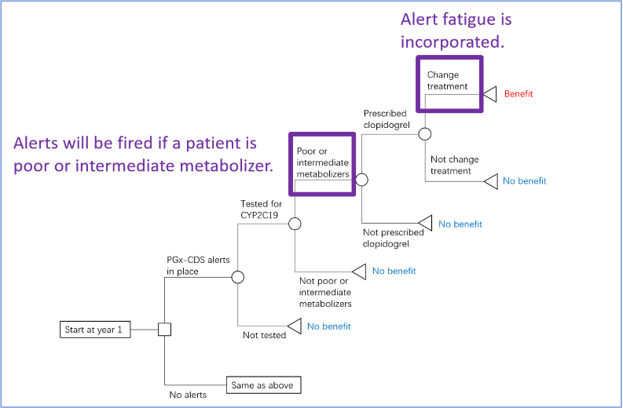
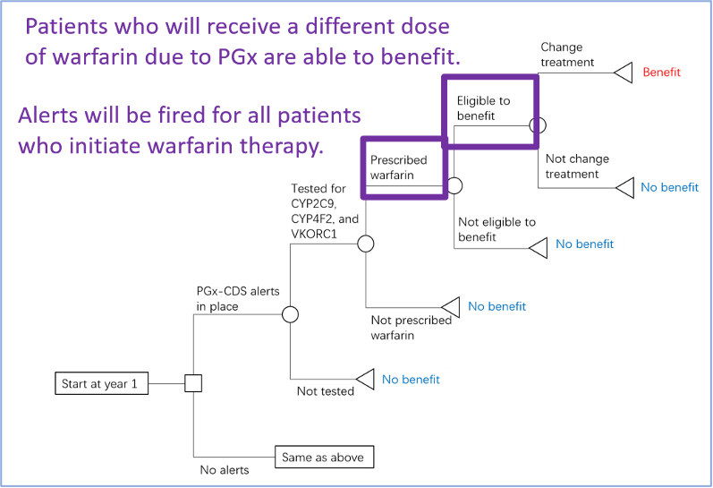

## What is PRECISE-VALUE?

* The prototype mathematical model – a decision tree – that estimates the value of Pharmacogenomic Testing (PGx) Clinical Decision Support (CDS) Alerts
* Provides a web-based, interactive R Shiny Application that generates customized estimates for Learning Health Systems (LHSs)

## PGx-CDS Alerts Background

* PGx testing offers significant potential to guide prescribing, avoid adverse events, and improve health outcomes. 
* CDS alerts that embed PGx testing results provides opportunities that PGx testing results are delivered and utilized in clinical practice. 

## PRECISE Value Model Summary

* Hypothetical scenario based on real world data
* Who?
    + 500,000 enrollees
    + Age range 18-100 years
    + Three ethnic groups: White, Black, Asian
    + Proportions reflect US general population
* What interventions are compared?
    + Tested Intervention: PGx-CDS Alerts
    + Alternative (Comparator): Standard of Care, i.e., no PGx-CDS Alerts.
* What diseases and drugs are modeled?
    + PGx testing on CYP2C19 shows opportunities to guide prescribing antiplatelets for patients with Acute Coronary Syndrome (ACS)
    + PGx testing on CYP2C9, VKORC1, and CYP4F2 shows opportunity to inform warfarin dosages for patients with Atrial Fibrillation (AF)
* What costs are included?
    + Costs of drugs
    + Costs of treating adverse events
    + Costs of developing and maintaining CDS Alerts
* How is effectiveness evaluated?
    + The number of adverse events averted
    + The quality adjusted life years (QALYs) gained by patients 

## Model Outcomes

* Implementation outcomes:
    + Number of alerts fired
    + Total costs
    + Medical costs
    + Administrative costs
* Clinical outcomes:
    + Number of each type of adverse event averted due to the PGx-CDS alerting system
* Economic evaluation:
    + Total costs of the PGx-CDS alerting system
    + Total QALYs gained due to the PGx-CDS alerting system
    + ICER

## Clopidogrel Alert Model

## Warfarin Alert Model

