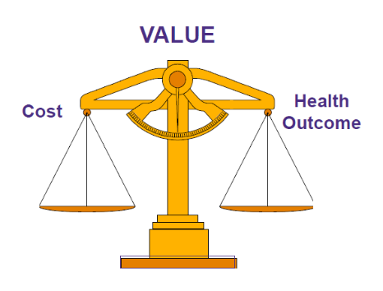

## Economic Evaluation

* Uses a mathematical model to compare two or more alternative courses of action in terms of both their costs and effectiveness. 

## Value

* Trade-off between costs and effectiveness (health outcomes) when comparing multiple health interventions. 

<center>



</center>

## Measures of Effectiveness (Health Outcomes)

* Quality-adjusted life years (QALYs) combines:
    * Quantity of life (survival) 
    * Quality of life 
* Number of adverse events
* Others possible 

## Results of Economic Evaluation

```{r econ_eval_table, echo = FALSE, warning = FALSE, message = FALSE}
library(tidyverse)
library(DT)
library(knitr)
library(kableExtra)
intervention <- c("Intervention A", "Intervention B: usual care")
total_costs <- c("$20,000", "$10,000")
total_qalys <- c(3.6, 3.15)
eval_table <- tibble(Intervention = intervention, 
                     `Total Costs` = total_costs, 
                     `Total QALYs` = total_qalys)
eval_table %>% 
  kbl() %>%
  kable_styling()
# datatable(eval_table,
#           rownames = FALSE,
#           options = list(pageLength = 10,
#                          sDom  = '<"top">rt<"bottom">'))
```

## Costs

* Total costs of each intervention 
* Incremental costs comparing
  * Inc.costs = Cost of Intervention A - Cost of Intervention B
	
## Effectiveness 

* Total QALYs of each intervention.
* Incremental effectiveness 
  * Inc. QALYs = QALYs of Intervention A - QALYs of Intervention B

## Incremental costs and effectiveness ratio (ICER)

* ICER = (Cost of Intervention A - Cost of Intervention B)/(QALYs of Intervention A - QALYs of Intervention B)

# Decision Made after Economic Evaluation:

* What is your willingness to pay (WTP) for one unit increase in effectiveness? 
* US WTP between \$ 50K and \$ 150K per QALY gained.
* How does the estimated ICER compare to your WTP?
  * If ICER is lower than WTP, then consider implementing the tested intervention. Provides good value for the investment.
  * If ICER is higher than WTP, then consider implementing the alternative intervention.
